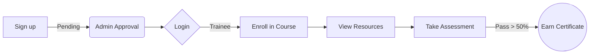
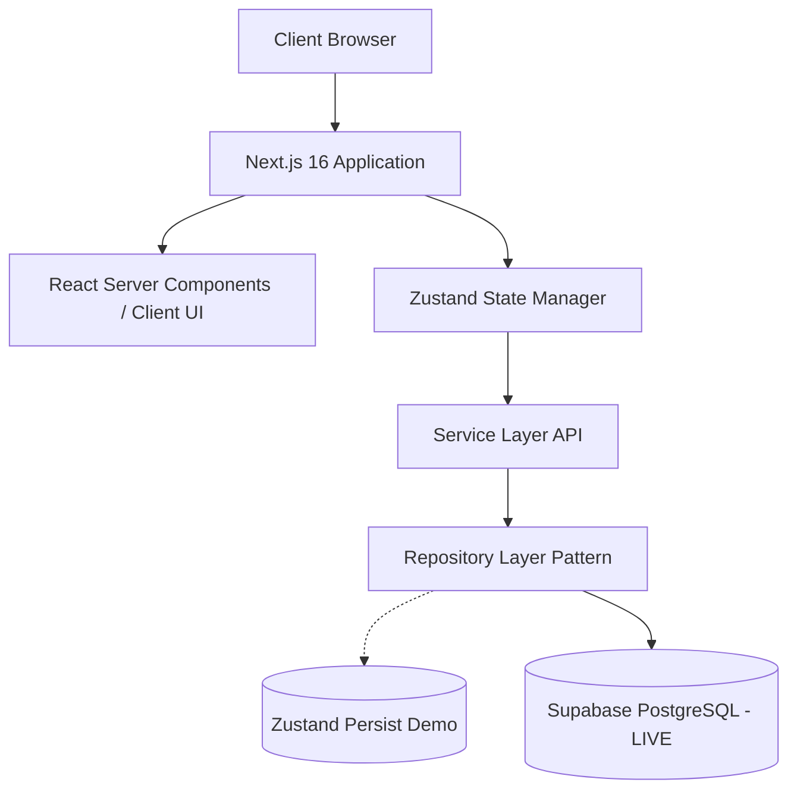

<div align="center">


[](https://git.io/typing-svg)


<br/>

**[About](#-about-the-project)** • 
**[Highlights](#-highlights)** • 
**[Features](#-features-by-role)** • 
**[Tech Stack](#-tech-stack)** • 
**[Getting Started](#-getting-started)** • 
**[Roadmap](#-roadmap)** • 
**[Contributing](#-contributing)** • 
**[License](#-license)**

</div>


---

## 🎯 About the project

AtmoCraft is a centralized, state-of-the-art web portal designed exclusively for the personnel of the India Meteorological Department (IMD) to solve problem statement **SIH26075**.

It transforms how IMD staff train, share knowledge, and build competencies by transitioning from scattered offline documents to a rich, interactive, and trackable digital learning ecosystem. Because continuous learning matters when you're predicting the weather and keeping the nation safe.

---

## ✨ Highlights

| 🧭 Role-Based Dashboards | 📚 Rich Course Catalog | ✅ Competency & Assessments |
| :--- | :--- | :--- |
| Distinct, secure layouts for Trainees, Trainers, and Admins. | Multimedia learning with videos, presentations, and interactive modules. | Rigorous MCQ assessments with instant auto-grading and feedback. |

| 🏆 Digital Passport | 🔍 Intelligent Trainer Finder | 📊 Real-time Analytics |
| :--- | :--- | :--- |
| Verifiable certification records tracking lifelong learning. | Connect with IMD experts based on exact proficiency levels. | Deep insights into learning trends and platform engagement. |

---

## 👥 Features by Role

<details>
<summary><b>🎓 Trainee Experience</b></summary>

- **Command Palette (`Cmd+K`)**: Rapid global navigation.
- **Dynamic Profile**: Digital passport tracking work experience, skills, and certificate uploads.
- **Course Catalog**: Filter by subject, level, and trainer to find the perfect training.
- **Interactive Resources Viewer**: Learn at your own pace with tracked progress.
- **Automated Assessments**: Take MCQs, get instant scores, and earn verifiable certificates if you score > 50%.
</details>

<details>
<summary><b>👨‍🏫 Trainer Experience</b></summary>

- **Analytics Dashboard**: See how many trainees are enrolled in your courses at a glance.
- **Resource Library**: Upload massive files (via IndexedDB locally, migrating to cloud) and assign them to your modules.
- **Questionnaire Creator**: Build and edit complex MCQ exams for your subjects.
</details>

<details>
<summary><b>🛡️ Administrator Experience</b></summary>

- **Platform KPI Overview**: Track total users, active courses, and system health.
- **Access Control**: Approve new signups, manage roles, and deactivate exiting employees.
</details>

---

## 📸 Screenshots
*(Adding soon to `docs/screenshots`)*

---

## 🔄 How It Works



### Architecture Blueprint


---

## 🛠 Tech Stack

<div align="center">
  <a href="https://skillicons.dev">
    
  </a>
</div>
<br/>

| Technology | Purpose |
|------------|---------|
| **Next.js 16** | App Router provides exceptional nested layouts and SEO. |
| **TypeScript** | Strict typing for enterprise reliability. |
| **Tailwind CSS v4** | Consistent, token-based design system and glassmorphism. |
| **Zustand** | Lighter, boilerplate-free state management. |
| **Supabase** | Robust PostgreSQL backend with Row Level Security (RLS). |

---

## 📂 Project Structure

```text
AtmoCraft/
├── src/
│   ├── app/                 # Next.js App Router (Grouped by Roles)
│   ├── components/          # Shared UI (Command Palette, Cards, Layouts)
│   ├── lib/
│   │   ├── db/repos.ts      # Repository pattern abstracting DB queries
│   │   ├── supabase.ts      # Live Supabase connection client
│   │   └── mock/            # Demo data seeders
│   └── store/               # Ephemeral Auth state
├── supabase/migrations/     # SQL schemas mapping exactly to TypeScript types
├── docs/                    # Technical blueprints and specifications
└── assets/                  # Animated SVGs and branding
```

---

## 🚀 Getting Started

### Prerequisites
- Node.js >= 20.0.0
- npm or yarn

### Installation
```bash
# Clone the repository
git clone https://github.com/snowdencubes/AtmoCraft.git
cd AtmoCraft

# Install dependencies (use --no-bin-links for Android/Termux environments)
npm install

# Start the dev server
npm run dev
```

### Build & Test
```bash
npm run build
npm run lint
```

### 🧪 Demo Accounts
*(Use these credentials to log into the application. They have been seeded into the Supabase authentication database.)*

| Role | Email | Password |
| :--- | :--- | :--- |
| 🛡️ **Admin** | `admin@imd.gov.in` | <kbd>Password123!</kbd> |
| 👨‍🏫 **Trainer 1** | `trainer1@imd.gov.in` | <kbd>Password123!</kbd> |
| 👨‍🏫 **Trainer 2** | `trainer2@imd.gov.in` | <kbd>Password123!</kbd> |
| 🎓 **Trainee 1** | `trainee1@imd.gov.in` | <kbd>Password123!</kbd> |
| 🎓 **Trainee 2** | `trainee2@imd.gov.in` | <kbd>Password123!</kbd> |
| 🎓 **Trainee 3** | `trainee3@imd.gov.in` | <kbd>Password123!</kbd> |

---

## 📖 Documentation
- [Architecture Blueprint](./docs/ARCHITECTURE.md)
- [Data Model & Schema](./docs/DATA_MODEL.md)
- [Service Layer API](./docs/SERVICES.md)
- [Business Assumptions](./docs/ASSUMPTIONS.md)
- [Resource Policy](./docs/RESOURCE_POLICY.md)
- [Resource Verification Report](./docs/RESOURCE_VERIFICATION.md)
- [Resource Credits](./docs/RESOURCE_CREDITS.md)

## 📚 Resource Library & Data Pipeline
The platform includes an automated data pipeline to validate, verify, and import open-access educational resources for meteorological training.
- **Pipeline Scripts:** Located in `scripts/resources/`. Run `node scripts/resources/validate.js` followed by `node scripts/resources/verify-links.js` to process new raw JSON data.
- **Licensing:** The pipeline strictly enforces redistribution licenses. Only files explicitly permitting redistribution are considered for local mirroring. See `docs/RESOURCE_CREDITS.md` for full attributions.
- [SIH Presentation Demo Script](./docs/DEMO_SCRIPT.md)

---

## 🗺️ Roadmap

- [x] Initial Next.js setup with Tailwind v4
- [x] Role-based route guards and authentication hashing
- [x] Trainee Flows (Enrollment, Resources, Assessments)
- [x] Trainer Flows (Libraries, Questionnaires)
- [x] Local DB to Supabase SQL Migration Scripts written
- [x] Connect Authentication to Supabase Auth
- [x] Connect File Uploads to Supabase Storage buckets
- [x] Email notifications
- [x] Hindi / Regional language support

---

## 🤝 Contributing

We welcome contributions! Please review our [Contributing Guide](./docs/CONTRIBUTING.md) and [Code of Conduct](./CODE_OF_CONDUCT.md). Ensure all PRs pass `npm run lint` and follow the Conventional Commits specification.

---

## 🌟 Contributors

<div align="center">
  <h3>Made by</h3>
  <a href="https://github.com/krishkumarcodes">
    
  </a>
  <p><b>Krish Kumar</b></p>
  <p><a href="mailto:krishkumarcodes@gmail.com">Contact Me</a></p>
  
  <br/>
  <a href="https://github.com/snowdencubes/AtmoCraft/graphs/contributors">
    
  </a>
</div>

---

## 📈 Star History

<div align="center">
  <a href="https://star-history.com/#snowdencubes/AtmoCraft&Date">
    <picture>
      <source media="(prefers-color-scheme: dark)" srcset="https://api.star-history.com/svg?repos=snowdencubes/AtmoCraft&type=Date&theme=dark" />
      <source media="(prefers-color-scheme: light)" srcset="https://api.star-history.com/svg?repos=snowdencubes/AtmoCraft&type=Date" />
      
    </picture>
  </a>
</div>

---

## 📜 License

This project is licensed under the MIT License - see the [LICENSE](./LICENSE) file for details.

---

## 🙏 Acknowledgments
- **Smart India Hackathon 2026**
- **Ministry of Earth Sciences, India Meteorological Department**
- *Note: This is a hackathon prototype and not an official IMD or MoES production product.*

<div align="center">
  
  <br/>
  <i>If you like this project, <a href="https://github.com/snowdencubes/AtmoCraft">give it a star ⭐️</a></i>
  <br/>
  <a href="#-atmocraft">⬆️ Back to Top</a>
</div>
