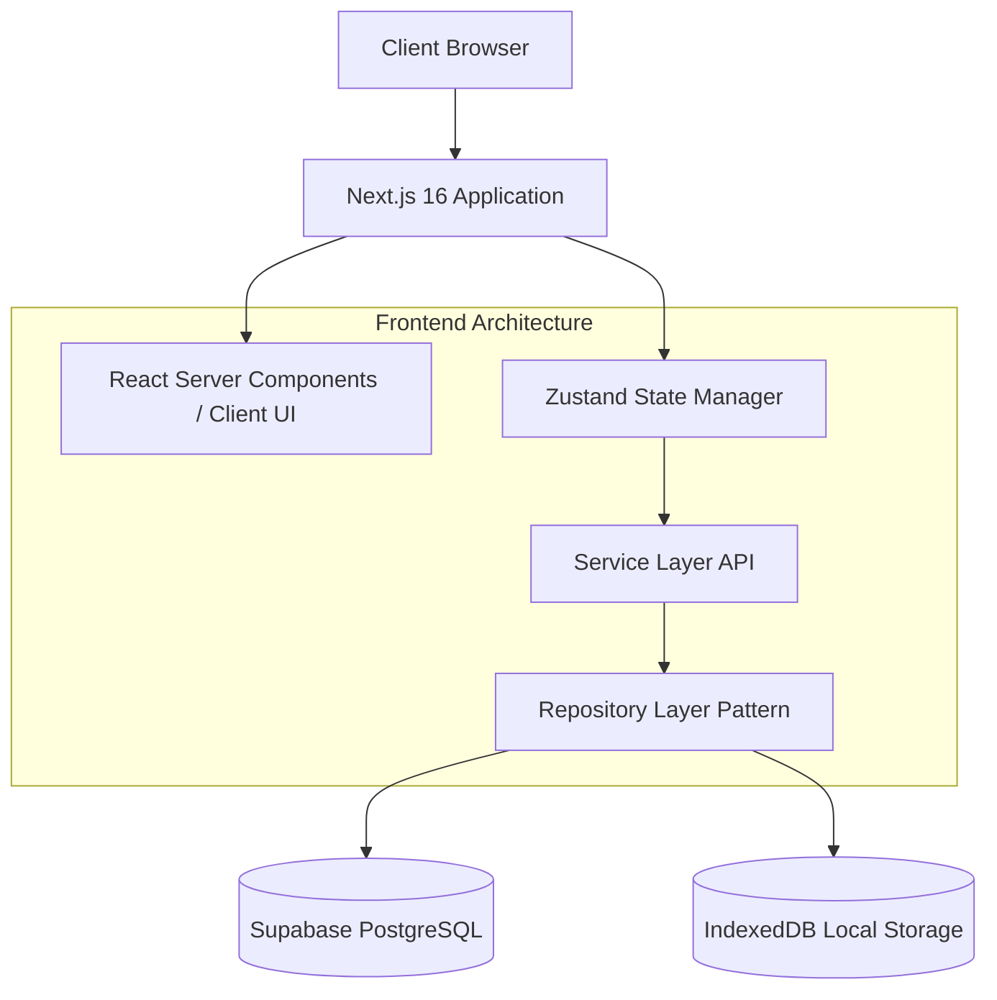
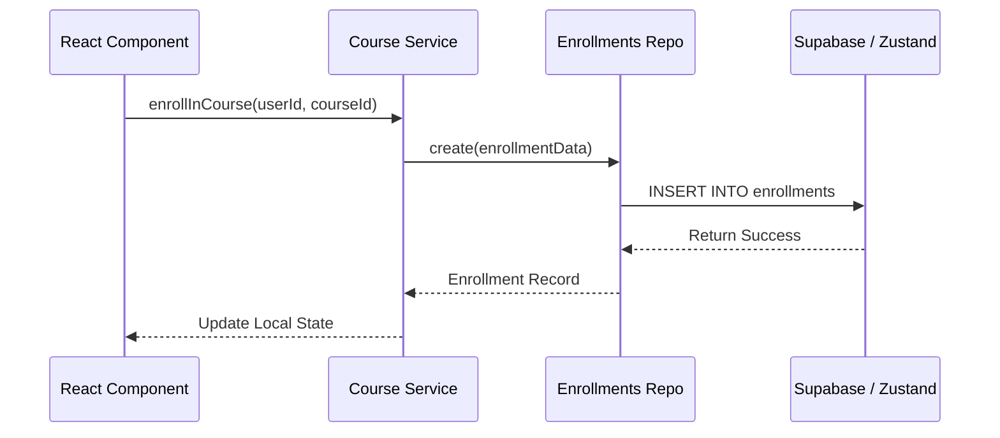

# 🏗️ AtmoCraft - Architecture Blueprint

This document outlines the high-level architecture and technical design decisions behind AtmoCraft, ensuring a scalable, secure, and maintainable platform for the India Meteorological Department (IMD).

## 1. System Architecture

AtmoCraft follows a modern, decoupled architecture designed for high performance and seamless scalability.

## 2. The Repository Pattern

To ensure we can easily swap data sources (e.g., moving from our Stage 1 local Demo Database to a live Supabase backend), we employ the **Repository Pattern**.

The Service Layer (`src/lib/services/*`) handles business logic (e.g., "calculate progress", "check user role") and NEVER queries the database directly. Instead, it calls the Repository Layer (`src/lib/db/repos.ts`), which acts as an abstraction over the data storage mechanism.

## 3. Core Technologies & Justification

| Technology | Purpose | Justification |
|------------|---------|---------------|
| **Next.js 16** | Full-stack Framework | App Router provides exceptional routing, SEO, and nested layouts necessary for our distinct Role-based dashboards. |
| **Tailwind CSS v4** | Styling | Utility-first CSS allows for rapid prototyping and enforces a strict, consistent design token system (variables). |
| **Zustand** | State Management | Significantly lighter and less boilerplate-heavy than Redux. Perfect for managing ephemeral session state (`auth-store.ts`). |
| **Web Crypto API** | Security | Native browser API used to securely hash passwords (`SHA-256`) before transmission or storage. |
| **IndexedDB** | File Storage | Allows trainees to download massive datasets or video lectures and store them locally, enabling offline viewing capabilities. |
| **Supabase** | Backend (Production) | Open-source Firebase alternative offering robust PostgreSQL, Row Level Security (RLS), and Realtime subscriptions. |

## 4. Security & Role-Based Access Control (RBAC)

Security is paramount for government applications. AtmoCraft implements a multi-layered security model:

1. **Route Guards (Frontend):** The `DashboardLayout` component inspects the `auth-store` session. If a Trainee attempts to access `/admin/dashboard`, they are immediately redirected.
2. **Service Layer Guards (Frontend):** Functions in `src/lib/services/*` verify the active session token/role before executing business logic.
3. **Row Level Security (Backend):** In Supabase, strict RLS policies ensure that even if the API is queried directly, a Trainee can only select their own `enrollments` and `profiles`.

## 5. Folder Structure Conventions

- `src/app/(role)/*`: Route groups isolate the layout and navigation for specific user roles (Trainee, Trainer, Admin) without affecting the URL path.
- `src/components/shared/*`: Pure UI components (Buttons, Cards, Command Palette) that contain NO business logic.
- `src/lib/mock/*`: The seeded demo data used to hydrate the application during development and presentations.
